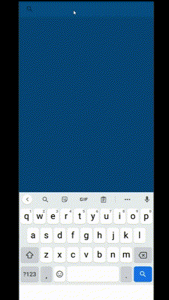
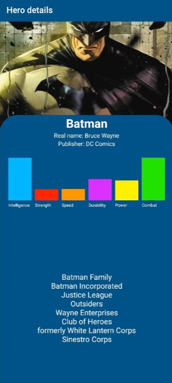

# Superhero API 🦸 Android App

## Technologies Used 💻

- Language: Kotlin
- Data Architecture: MVP (Model-View-Presenter)
- Android Frameworks: Android SDK, Android Jetpack
- UI Components: XML layout with Material Design components
- RecyclerView: Display of superhero information
- View Binding: Interaction with UI components
- Kotlin Coroutines: Handling of asynchronous programming tasks
- Libraries: [Retrofit](https://square.github.io/retrofit/) for API requests, [Picasso](https://square.github.io/picasso/) for image loading and caching
- Version Control: Git
- Build Tool: Gradle
  

## Features ⚙️

- Utilizes the Superhero API to fetch detailed information about superheroes.
- Search functionality using SearchView and organized results with RecyclerView.
- Asynchronous programming using Kotlin Coroutines for API data retrieval.
- Progress Bar for visual feedback during superhero information fetching.
- ImageView scaleType for optimal and visually appealing display of superhero images.
- API Service Interface for structured API calls.
  

## Key Components 🛠️

### 🔨 Adapters/Controllers:

#### SuperheroAdapter
- **Purpose:** Manages the display of superhero search results in a RecyclerView.
- **Responsibilities:**
  - Inflates superhero item views.
  - Binds superhero data to the item views.

#### SuperheroViewHolder
- **Purpose:** Handles the view representation for individual superheroes within the RecyclerView.
- **Responsibilities:**
  - Represents the layout and UI elements for a single superhero item.
  - Provides methods to bind superhero data to the UI.

### 🔨 Models:
#### SuperHeroDataResponse
- **Purpose:** Represents the response from the Superhero API, including superhero details.
- **Responsibilities:**
  - Holds data about the response, such as whether it was successful.
  - Contains a list of superhero items.

#### SuperHeroDetailResponse
- **Purpose:** Represents detailed information about a superhero.
- **Responsibilities:**
  - Includes data such as name, powerstats, image, biography, and connections.

### 🔨 Networking:
#### ApiService
- **Purpose:** Defines the API endpoints for fetching superhero data.
- **Responsibilities:**
  - Includes methods for searching superheroes and fetching detailed information about a specific superhero.

### 🔨 Data:
#### SuperHeroDataResponse
- **Purpose:** Represents the response from the Superhero API, including superhero details.
- **Responsibilities:**
  - Holds data about the response, such as whether it was successful.
  - Contains a list of superhero items.

### 🔨 Contract:
#### SuperheroContract
- **Purpose:** Defines the contract between the View and Presenter.
- **Responsibilities:**
  - Specifies the methods that the View and Presenter should implement.

### 🔨 Presenter:
#### SuperheroPresenter
- **Purpose:** Implements the business logic and handles communication between the View and Model.
- **Responsibilities:**
  - Interacts with the SuperheroRepository to fetch and process superhero data.
  - Updates the View based on the results of these operations.

### 🔨 UI:
#### MainActivity
- **Purpose:** Displays a SearchView, RecyclerView, and handles user interactions for superhero search.
- **Responsibilities:**
  - Initiates and manages the UI components, including the SearchView and RecyclerView.
  - Listens for user input and triggers superhero searches.
  - Communicates with the SuperheroAdapter to display search results.

#### DetailSuperheroActivity
- **Purpose:** Displays detailed information about a selected superhero.
- **Responsibilities:**
  - Retrieves and displays detailed information about a specific superhero.
  - Utilizes the SuperheroAdapter and SuperheroViewHolder for UI consistency.

## Key Features 🚀
- Explore and access a comprehensive database of superheroes through the [SuperheroAPI](https://superheroapi.com/).
- Visual feedback with a Progress Bar during superhero information retrieval.
- Utilizes some Android features for a basic user-friendly experience.

## Media 📷

## How to Use ✨

- Clone the repository.
- Open the project in Android Studio.
- Generate your own Token at [SuperheroAPI](https://superheroapi.com/).
- Add your personal Token to 'ApiService'.
- Build and run on an Android device or emulator.

## Additional Notes 📝

Feel free to contribute, open issues, or use this project as a learning resource for Android development and API integration. The project leverages modern Android development practices and provides insights into using View Binding, Coroutines, Retrofit, and Picasso. 

Happy coding 👌! 
